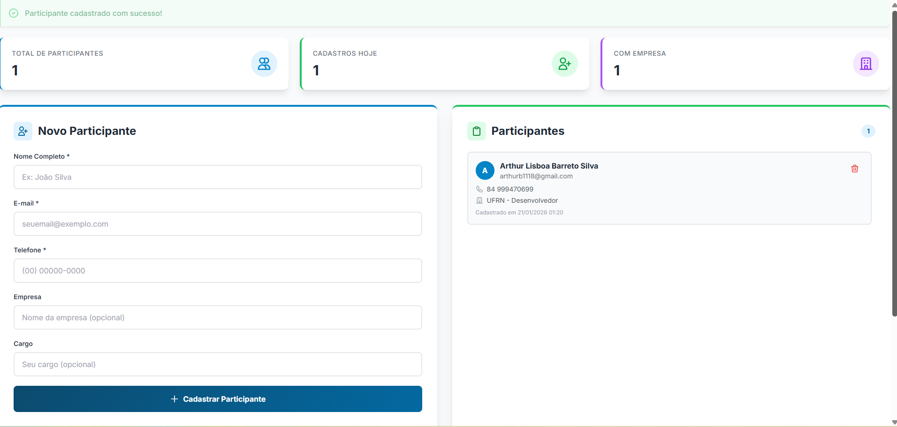

# connect-hub
# 🎯 Connect Hub - Sistema de Cadastro de Participantes       > Sistema moderno e elegante para gerenciar participantes de eventos, desenvolvido com Laravel 11 e Tailwind CSS.  ---  ## 📸 Preview do Sistema    ---  ## 📋 Sobre o Projeto  O **Connect Hub** é uma aplicação web completa que permite:  ✅ Cadastrar participantes com informações completas   ✅ Visualizar lista atualizada em tempo real   ✅ Acompanhar estatísticas do evento   ✅ Remover participantes quando necessário   ✅ Interface responsiva e moderna  ### 🎨 Destaques Visuais  - **Design Institucional**: Paleta em azul profundo com gradientes suaves - **Experiência Fluída**: Animações e transições em todos os elementos - **Feedback Visual**: Mensagens de sucesso e confirmações de ação - **Cards Elegantes**: Uso estratégico de sombras e bordas arredondadas - **Responsivo**: Funciona perfeitamente em mobile, tablet e desktop  ---  ## 🚀 Tecnologias Utilizadas  | Tecnologia | Descrição | |------------|-----------| | **Laravel 11** | Framework PHP moderno e elegante | | **PHP 8.x** | Linguagem de programação | | **Tailwind CSS** | Framework CSS utilitário | | **SQLite** | Banco de dados leve e portátil | | **Blade** | Engine de templates do Laravel |  ---  ## 📦 Pré-requisitos  Antes de começar, você precisa ter instalado em sua máquina:  - [PHP 8.1+](https://www.php.net/downloads) - [Composer](https://getcomposer.org/)  ---  ## ⚙️ Instalação  Siga os passos abaixo para rodar o projeto localmente:  ### 1️⃣ Clone o repositório  ```bash git clone https://github.com/seu-usuario/connect-hub.git cd connect-hub ```  ### 2️⃣ Instale as dependências  ```bash composer install ```  ### 3️⃣ Configure o arquivo de ambiente  ```bash cp .env.example .env ```  Abra o arquivo `.env` e configure o banco de dados SQLite:  ```env DB_CONNECTION=sqlite # Comente ou remova estas linhas: # DB_HOST=127.0.0.1  - Exemplo  # DB_PORT=3306 # DB_DATABASE=laravel ```  ### 4️⃣ Gere a chave da aplicação  ```bash php artisan key:generate ```  ### 5️⃣ Crie o banco de dados  ```bash touch database/database.sqlite ```  ### 6️⃣ Execute as migrations  ```bash php artisan migrate ```  ### 7️⃣ Inicie o servidor  ```bash php artisan serve ```  🎉 **Pronto!** Acesse `http://localhost:8000` no seu navegador.  ---  ## 🗂️ Estrutura do Projeto  ``` connect-hub/ ├── app/ │   ├── Http/Controllers/ │   │   └── ParticipantController.php  # Lógica de negócio │   └── Models/ │       └── Participant.php            # Model de participante ├── database/ │   ├── migrations/                    # Estrutura do banco │   └── database.sqlite                # Banco de dados ├── resources/ │   └── views/ │       ├── layouts/ │       │   └── app.blade.php          # Layout base │       └── dashboard.blade.php        # Tela principal ├── routes/ │   └── web.php                        # Rotas da aplicação └── .env                               # Configurações ```  ---  ## 🎯 Funcionalidades  ### ✨ Cadastro de Participantes  - Nome completo (obrigatório) - E-mail único (obrigatório) - Telefone (obrigatório) - Empresa (opcional) - Cargo (opcional)  ### 📊 Dashboard com Estatísticas  - Total de participantes cadastrados - Cadastros realizados hoje - Participantes com empresa vinculada  ### 📋 Lista Interativa  - Visualização em tempo real - Avatar com inicial do nome - Informações organizadas e claras - Botão de exclusão com confirmação  ### 🎨 Interface Moderna  - Gradientes personalizados - Hover effects suaves - Animações de transição - Design responsivo  ---  ## 💾 Banco de Dados  O projeto utiliza **SQLite**, um banco de dados leve que armazena todos os dados em um único arquivo (`database/database.sqlite`).  ### Estrutura da Tabela `participants`  | Campo | Tipo | Descrição | |-------|------|-----------| | `id` | Integer | Identificador único | | `name` | String | Nome completo | | `email` | String | E-mail (único) | | `phone` | String | Telefone | | `company` | String | Empresa (opcional) | | `position` | String | Cargo (opcional) | | `created_at` | Timestamp | Data de cadastro | | `updated_at` | Timestamp | Data de atualização |  ---  ## 🧪 Testando a Aplicação  ### Cadastrar um Participante  1. Preencha o formulário na lateral esquerda 2. Clique em "Cadastrar Participante" 3. Veja a confirmação de sucesso 4. O participante aparece imediatamente na lista  ### Remover um Participante  1. Clique no ícone de lixeira ao lado do participante 2. Confirme a exclusão 3. O participante é removido instantaneamente  ---  ## 🎨 Personalização  ### Alterar Cores  Edite o arquivo `resources/views/layouts/app.blade.php`:  ```javascript tailwind.config = {     theme: {         extend: {             colors: {                 primary: {                     600: '#SUA_COR',  // Altere aqui                     700: '#SUA_COR',                     // ...                 }             }         }     } } ```   **Feito com Laravel 11 • Tailwind CSS • SQLite**
